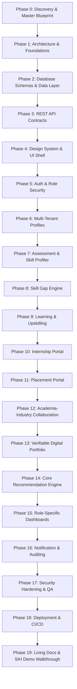
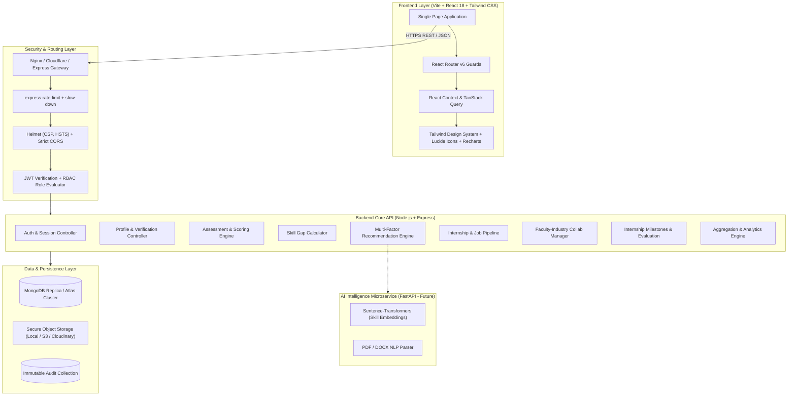
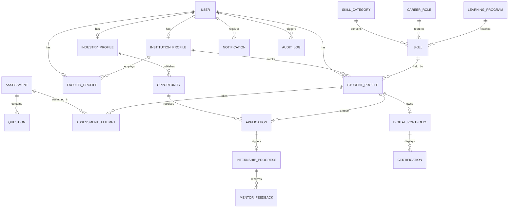
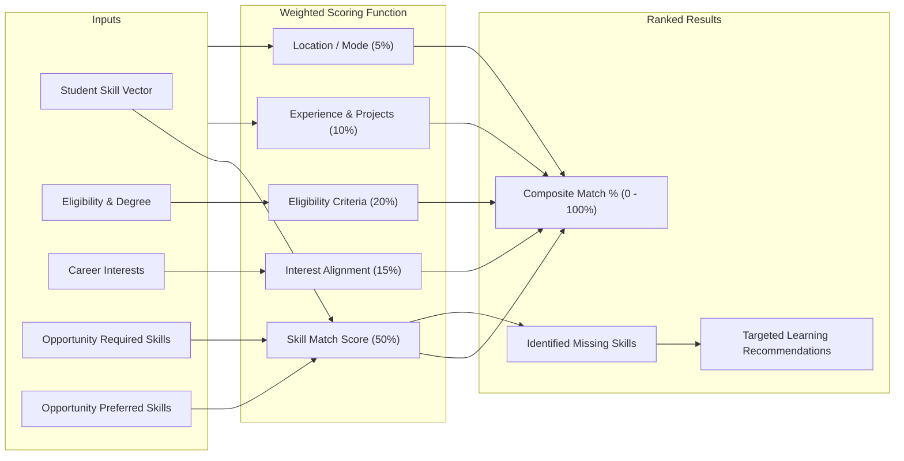

# MASTER BLUEPRINT & ARCHITECTURAL SPECIFICATION
## Academia–Industry Collaboration Portal (SkillBridge Enterprise)

> **Document Version:** 1.0.0-PROD  
> **Target System:** Production Multi-Tenant Platform  
> **Lifecycle:** Assess → Analyze → Learn → Apply → Collaborate → Intern → Get Placed → Track Progress  

---

## PART A — Executive Summary

### 1. Vision and Objective
The **Academia–Industry Collaboration Portal** is a next-generation, secure, enterprise-grade web platform engineered to bridge the structural divide between higher education curricula and real-world industrial demands. Built upon a core philosophy of **"Skill-First Career Intelligence"**, the platform unifies students, faculty, academic administrators, and corporate recruiters into a single data-driven ecosystem.

Rather than acting as a static job board or basic CRUD management tool, the platform operates as an **Intelligent Human Capital Development Engine**. It continuously:
1. **Benchmarks student capabilities** through multi-dimensional technical, soft-skill, and aptitude assessments.
2. **Quantifies empirical skill gaps** by comparing student skill vectors with live job descriptions, target career archetypes, and macro industry demand trends.
3. **Prescribes personalized upskilling pathways** (courses, certifications, workshops, and faculty mentorship).
4. **Facilitates high-compatibility recruitment** for internships and full-time placements through transparent, algorithmic matching.
5. **Monitors experiential learning** throughout the internship lifecycle via structured milestone tracking, periodic mentor evaluations, and verifiable credentialing.
6. **Empowers academic institutions and government regulators** with actionable macro-analytics on placement velocity, curriculum gaps, and industry hiring trajectories.

### 2. Multi-Stakeholder Value Proposition
* **Students:** Real-time visibility into their market readiness, clear pathways to close skill deficits, transparent compatibility scoring on applications, and a cryptographically verifiable digital portfolio.
* **Industry & Recruiters:** Substantial reduction in candidate screening overhead through skill-verified applicants, pre-calculated role-fit scores, custom internship postings, and structured evaluation channels.
* **Faculty & Academicians:** Direct conduits to industrial consulting, joint research initiatives, Faculty Development Programs (FDPs), industry sabbaticals, and student mentorship tracking.
* **Institutions & Administrators:** Centralized visibility across departments, macro skill-gap heatmaps to guide syllabus updates, automated placement cell workflows, and verified compliance reporting for regulatory bodies (e.g., NAAC, NBA, SIH, AICTE/Ministry oversight).
* **Super Administrators / Ministry:** Nationwide policy insights, cross-institutional benchmarks, and strategic workforce alignment.

---

## PART B — Problem Analysis

### 1. The Existing Landscape
Higher education across engineering, management, and specialized domains (including healthcare and Ayush) suffers from an acute feedback latency: academic syllabi are revised over multi-year cycles, whereas industry technical stacks and regulatory requirements evolve in quarters.

### 2. Stakeholder Pain Points
| Stakeholder | Legacy Pain Points | Systemic Solution Provided |
| :--- | :--- | :--- |
| **Students** | • Unaware of why applications are rejected<br>• No quantitative benchmark of current skill levels<br>• Disorganized preparation across random internet courses<br>• Lack of verified digital proof of project work | • Objective skill assessments & dynamic radar profiles<br>• Real-time skill gap analysis per target role<br>• Direct course/workshop recommendations linked to missing skills<br>• Tamper-proof, shareable digital portfolio |
| **Industry** | • Overwhelmed by thousands of unvetted, identical resumes<br>• High cost of preliminary screening & interviewing<br>• Lack of direct institutional collaboration channels<br>• No structured visibility into intern progress during tenure | • Algorithmic candidate pre-ranking by match percentage<br>• Granular required vs. preferred skill filtering<br>• Direct faculty collaboration & research portals<br>• Milestone-driven weekly intern tracking & digital feedback |
| **Faculty** | • Isolated from modern corporate tech & clinical practices<br>• Difficulty finding corporate research funding or consulting<br>• No platform to showcase academic innovations to industry | • Dedicated Faculty Opportunities portal (FDPs, consulting)<br>• Joint industry-academia research matchmaking<br>• Direct student mentorship tracking workflows |
| **Institutions** | • Manual, spreadsheet-based placement tracking<br>• Zero real-time insight into industry skill demands<br>• Fragmented communication between departments and companies | • Executive analytics dashboard with departmental drilldowns<br>• Industry skill demand heatmaps for curriculum tuning<br>• Automated placement pipeline and reporting |

### 3. Expected Quantitative Impact
* **70% Reduction** in corporate candidate screening time via pre-filtered compatibility scoring.
* **3x Increase** in student upskilling completion by explicitly connecting courses to job readiness.
* **100% Traceability** of internships from posting to final institutional endorsement and certification.

---

## PART C — Feature Breakdown Matrix

| Module | Feature | Target User | Priority | Dependencies | Scope |
| :--- | :--- | :--- | :---: | :--- | :---: |
| **MOD-01: Auth & RBAC** | JWT Auth with Refresh Tokens, Argon2 Password Hashing | All | P0 | Database | MVP |
| **MOD-01: Auth & RBAC** | Role-Based Access Control (5 Roles), Route Guards | All | P0 | MOD-01 Base | MVP |
| **MOD-01: Auth & RBAC** | Email Verification & Password Reset Flow | All | P1 | SMTP Service | MVP |
| **MOD-02: Profiles** | Student Comprehensive Profile (Education, Skills, Bio) | Student | P0 | MOD-01 | MVP |
| **MOD-02: Profiles** | Industry Verification & Recruiter Management | Industry, Admin | P0 | MOD-01 | MVP |
| **MOD-02: Profiles** | Faculty Profile (Research, Publications, Expertise) | Faculty | P1 | MOD-01 | MVP |
| **MOD-02: Profiles** | Institution Profile (AISHE/Code, Depts, Coordinators) | Institution Admin | P1 | MOD-01 | MVP |
| **MOD-03: Assessment** | Question Bank Management (Difficulty, Topics, Tags) | Admin, Faculty | P0 | Database | MVP |
| **MOD-03: Assessment** | Timed Quiz Engine (MCQs, Proctoring flags, Auto-grade) | Student | P0 | Question Bank | MVP |
| **MOD-03: Assessment** | Dynamic Skill Profiler (Radar charts, % proficiency) | Student | P0 | Quiz Engine | MVP |
| **MOD-04: Skill Gap** | Target Career Role Benchmarks (Required vs Nice-to-have) | Admin, Industry | P0 | Skill Taxonomy | MVP |
| **MOD-04: Skill Gap** | Mathematical Gap Analysis ($Current - Required$) | Student | P0 | MOD-02, MOD-03 | MVP |
| **MOD-04: Skill Gap** | Criticality Categorization (Critical, High, Medium, Low) | Student | P0 | Gap Calculation | MVP |
| **MOD-05: Learning** | Program Listings (Courses, Workshops, FDPs, Certs) | Institution, Industry | P1 | Database | MVP |
| **MOD-05: Learning** | Personalized Learning Recommender (Closing Skill Gaps) | Student | P0 | MOD-04, Programs | MVP |
| **MOD-06: Internships** | Listing Creation (Skills, Stipend, Mode, Duration) | Industry | P0 | MOD-02 | MVP |
| **MOD-06: Internships** | Application Pipeline (Apply, Review, Shortlist, Offer) | Student, Industry | P0 | Listings, Profiles | MVP |
| **MOD-07: Placements** | Full-Time Job Postings & Eligibility Validation | Industry | P0 | MOD-02 | MVP |
| **MOD-07: Placements** | Candidate Compatibility Ranking & Pipeline Management | Industry | P0 | MOD-08 | MVP |
| **MOD-08: Recommender** | Multi-Factor Weighted Compatibility Engine | Student, Industry | P0 | MOD-03, Listings | MVP |
| **MOD-08: Recommender** | Vector/Embedding Semantic Matcher (NLP Resume & JD) | All | P2 | Python AI Service | Future |
| **MOD-09: Portfolio** | Public Digital Portfolio with Slug & Social Cards | Student, Public | P1 | MOD-02, MOD-03 | MVP |
| **MOD-09: Portfolio** | Verifiable Certificate Badges (Hash & QR validation) | Student, Industry | P1 | MOD-11, PDF Gen | MVP |
| **MOD-10: Collaboration**| Joint Research, Consultancy, Guest Lectures, Mentorship| Faculty, Industry | P1 | MOD-02 | MVP |
| **MOD-11: Tracking** | Weekly Milestones, Timesheets, and Progress Reports | Student, Mentor | P1 | MOD-06 | MVP |
| **MOD-11: Tracking** | Final Evaluation & Automated Completion Certificate | Mentor, Student | P1 | Milestones | MVP |
| **MOD-12: Analytics** | Student Personal Career & Skill Progression Dashboard | Student | P0 | All Student Data | MVP |
| **MOD-12: Analytics** | Industry Recruitment Funnel & Candidate Skill Insights | Industry | P0 | Applications | MVP |
| **MOD-12: Analytics** | Institutional Placement KPIs & Regional Demand Heatmap | Institution, Admin | P0 | Aggregation Pipeline | MVP |
| **MOD-13: Notifications**| In-app Real-time Alerts & Event Triggers | All | P1 | Socket / Polling | MVP |
| **MOD-14: Audit & Logs** | Immutable System Audit Logging for Compliance | Super Admin | P1 | Middleware | MVP |

---

## PART D — MVP vs. Advanced System Scope

### 1. Minimum Viable Product (MVP - Phases 0 to 16)
The MVP provides an uncompromised, fully working, production-grade monolithic web application capable of delivering the full Smart India Hackathon (SIH) end-to-end demonstration flow:
* Full Role-Based Access Control for 5 roles: `STUDENT`, `FACULTY`, `INDUSTRY`, `INSTITUTION_ADMIN`, `SUPER_ADMIN`.
* Standardized Skill Taxonomy with categorized domains (Technical, Clinical, Manufacturing, Soft Skills).
* Interactive timed skill assessment engine yielding empirical student skill proficiencies.
* Mathematical Skill Gap Engine comparing student proficiency vectors with target career roles.
* Transparent, weighted multi-factor recommendation engine (Score 0–100%) ranking opportunities and courses.
* Complete Internship & Job posting, candidate application, shortlisting, and status tracking pipeline.
* Weekly milestone tracking for active interns with mentor evaluation and certificate issuance.
* Publicly shareable digital portfolio with verified badges.
* Distinct, tailored analytics dashboards for Student, Industry, and Institution.

### 2. Advanced Enterprise Scope (Future / Post-MVP)
* **Python FastAPI Microservice:** Zero-shot resume parsing, semantic embedding matching using `all-MiniLM-L6-v2` or `OpenAI text-embedding-3-small`, and predictive salary/placement modeling.
* **Blockchain/Decentralized Credential Verification:** Publishing credential hashes on Hyperledger or Polygon.
* **Automated Coding Sandbox / Video Interviewing:** In-browser IDE execution for software tests and WebRTC peer-to-peer interview rooms.
* **Multi-Language Localization:** Real-time translation into Indian regional languages.

---

## PART E — Complete Phase-by-Phase Roadmap



### Execution Protocol
For each phase, the engineer will:
1. Review prerequisites and architectural constraints.
2. Formulate explicit database, API, and UI modifications.
3. Implement clean, modular code with complete error boundaries.
4. Execute automated verification tests.
5. Update documentation and provide a structured `PROJECT STATE` report.

---

## PART F — System Architecture



---

## PART G — Database Architecture & ER Model



### Core Collections Specification
1. **`users`**: Base credentials, email, passwordHash, role (`STUDENT`, `FACULTY`, `INDUSTRY`, `INSTITUTION_ADMIN`, `SUPER_ADMIN`), isVerified, status (`ACTIVE`, `PENDING_APPROVAL`, `SUSPENDED`).
2. **`student_profiles`**: Personal details, rollNumber, degree, branch, passingYear, institutionId (ref), skills `[{ skillId, proficiency, verifiedAt }]`, targetCareerRole (ref), resumeUrl, cgpa.
3. **`industry_profiles`**: companyName, cinRegistrationNumber, industrySector, website, verifiedByAdmin (boolean), hqLocation, recruiterContact.
4. **`faculty_profiles`**: department, designation, yearsExperience, researchInterests, publications, industryConsultingHistory.
5. **`institution_profiles`**: institutionName, aisheCode, accreditation, approvedDomains, activeStudentsCount.
6. **`skills`**: name, categoryId (ref), slug, industryDemandScore (0-100), standardBenchmark.
7. **`assessments`**: title, domain, timeLimitMinutes, passingPercentage, questions `[questionId]`.
8. **`assessment_attempts`**: studentId, assessmentId, score, answers `[{ questionId, chosenOption, isCorrect }]`, completedAt.
9. **`opportunities`**: industryId, title, type (`INTERNSHIP`, `JOB`, `APPRENTICESHIP`, `LIVE_PROJECT`), requiredSkills `[{ skillId, minProficiency }]`, preferredSkills `[skillId]`, stipend, durationMonths, location, openings, deadline, status.
10. **`applications`**: opportunityId, studentId, matchScore, missingSkills `[skillId]`, status (`APPLIED`, `UNDER_REVIEW`, `SHORTLISTED`, `INTERVIEW`, `SELECTED`, `REJECTED`, `WITHDRAWN`), statusHistory.
11. **`internship_progress`**: applicationId, studentId, mentorId, weeklyLogs `[{ weekNumber, tasksDone, hoursSpent, studentNotes, mentorRemark, status }]`, finalGrade, completionCertificateUrl.
12. **`learning_programs`**: title, providerType (`INDUSTRY`, `INSTITUTION`), providerId, coveredSkills `[skillId]`, level, durationHours, url, cost.

---

## PART H — Unified REST API Architecture

### Standard Envelope Convention
All API endpoints communicate exclusively in structured JSON with consistent payloads:
```json
{
  "success": true,
  "statusCode": 200,
  "message": "Operation completed successfully",
  "data": { ... },
  "meta": {
    "page": 1,
    "limit": 20,
    "totalRecords": 150,
    "totalPages": 8
  }
}
```

Standard Error Envelope:
```json
{
  "success": false,
  "statusCode": 400,
  "error": "BAD_REQUEST",
  "message": "Validation failed: 'email' must be a valid institutional address",
  "details": [ ... ]
}
```

### Route Groups
* `/api/auth`: Register, Login, Refresh, Logout, ForgotPassword, ResetPassword, Me.
* `/api/users`: Profile discovery, Status toggles, Admin approvals.
* `/api/students`: Profile CRUD, Enrolled skills, Target role setting, Portfolio export.
* `/api/skills`: Taxonomy tree, Category listings, Skill search and autocomplete.
* `/api/assessments`: Active quizzes, Take assessment, Submit attempt, Historical scores.
* `/api/skill-gap`: Calculate role gap, Compare against industry vacancies, Actionable recommendations.
* `/api/opportunities`: Search, Filter, Create (Industry), Update, Close, Delete.
* `/api/applications`: Apply, Candidate applications, Opportunity applicant list, Stage status change.
* `/api/internship-tracking`: Weekly milestone submission, Mentor review, Final signoff, Certificate issuance.
* `/api/collaborations`: Research calls, Consulting requests, Guest lecture scheduling.
* `/api/recommendations`: Top matched opportunities, Top matched students for recruiters, Recommended courses.
* `/api/analytics`: Student metrics, Industry funnel metrics, Institutional placement & skill-demand heatmaps.
* `/api/notifications`: Get my notifications, Mark as read, Unread count.

---

## PART I — UI/UX Architecture & Layout System

### Visual Theme & Design Tokens
* **Typography:** Inter & Outfit via Google Fonts for sleek readability.
* **Palette:**
  * Backgrounds: Deep Slate (`#0B1120`, `#0F172A`) for dark mode; Clean White / Off-Slate (`#F8FAFC`, `#FFFFFF`) for light mode.
  * Primary Accent: Royal Indigo / Emerald (`#4F46E5`, `#10B981`) conveying technical rigor and academic prestige.
  * Neutral Surfaces: Polished borders (`#E2E8F0` / `#1E293B`) with glassmorphism backdrop blur.
  * Badges & States: Emerald (Match > 80%), Amber (Match 50-79%), Rose (Match < 50%, Critical Gaps).
* **Responsive Architecture:** Fully responsive desktop-first dashboard with collapsible mobile drawer, touch-friendly tables, and accessible ARIA attributes.

---

## PART J — Mathematical Recommendation Engine



### Mathematical Formula
For a Student $S$ and an Opportunity $O$:
$$\text{Total Match Score} = (0.50 \cdot S_{\text{skill}}) + (0.20 \cdot S_{\text{elig}}) + (0.15 \cdot S_{\text{interest}}) + (0.10 \cdot S_{\text{exp}}) + (0.05 \cdot S_{\text{loc}})$$

Where:
$$S_{\text{skill}} = \left( \frac{|S \cap R|}{|R|} \times 75 \right) + \left( \frac{|S \cap P|}{|P|} \times 25 \right)$$
*(If no preferred skills are listed, $S_{\text{skill}} = \frac{|S \cap R|}{|R|} \times 100$)*.

### Skill Gap Categorization Rules
For each skill $k \in \text{Target Role Requirements}$:
$$\text{Gap}(k) = \text{RequiredProficiency}(k) - \text{CurrentStudentProficiency}(k)$$
* **Critical Gap:** $\text{Gap}(k) \ge 30\%$ or student lacks the required fundamental skill entirely.
* **High Gap:** $20\% \le \text{Gap}(k) < 30\%$.
* **Medium Gap:** $10\% \le \text{Gap}(k) < 20\%$.
* **Low Gap:** $1\% \le \text{Gap}(k) < 10\%$.
* **Satisfactory / Mastered:** $\text{Gap}(k) \le 0\%$.

---

## PART K — Security Architecture & Compliance

1. **Authentication Security:** Argon2id or bcrypt (salt rounds 12) for password hashing; short-lived JWT access tokens (15 minutes) paired with HttpOnly, SameSite=Strict refresh cookies (7 days).
2. **Authorization Guards:** Enforced RBAC middleware checking both role membership and resource tenancy (e.g., student can only mutate their own profile, recruiters can only view applicants to their own opportunities).
3. **Data Protection:** Helmet middleware enabling strict Content-Security-Policy (CSP), HTTP Strict Transport Security (HSTS), X-Frame-Options (`DENY`), and X-Content-Type-Options (`nosniff`).
4. **Rate Limiting:** IP-based sliding window rate limiter on auth routes (`10 requests / 15 min`) and general API routes (`100 requests / min`).
5. **Input Validation:** Strict request body validation via Zod / Joi / express-validator sanitizing HTML to prevent XSS and NoSQL injection.
6. **Audit Trail:** Immutable logging of all sensitive administrative approvals, grade evaluations, and status modifications.

---

## PART L — Testing Strategy

* **Unit Testing:** Comprehensive test suites using Vitest / Jest covering the skill match algorithm, gap calculator, and token verifiers.
* **Integration Testing:** Supertest-driven API suites verifying authentication flows, role access enforcement, and transaction lifecycles.
* **End-to-End Testing:** Automated journey tests simulating:
  1. Student registration → Assessment → Gap discovery → Course enrolment → Internship application.
  2. Recruiter registration → Company verification → Posting internship → Reviewing ranked candidates → Shortlisting.
  3. Internship milestone tracking → Weekly mentor review → Final certificate issuance.
* **Target Test Coverage:** $\ge 80\%$ statement and branch coverage across business logic.

---

## PART M — Deployment Strategy

* **Frontend:** Built with Vite into optimized static assets; served via CDN / Vercel / Nginx with asset fingerprinting and Gzip/Brotli compression.
* **Backend:** Node.js Express server configured with PM2 process manager or Docker container orchestration.
* **Database:** MongoDB Atlas Mongoose cluster configured with automated daily backups, IP allowlisting, and optimized compound indexes.
* **Continuous Integration:** GitHub Actions CI workflow running linter, type checks, and automated integration tests on every commit.

---

## PART N — Living Documentation Strategy (`/docs`)

A dedicated `/docs` directory will maintain continuous, synchronized technical documentation:
```text
docs/
├── 01-project-overview.md
├── 02-requirements.md
├── 03-user-personas.md
├── 04-system-architecture.md
├── 05-database-design.md
├── 06-api-documentation.md
├── 07-authentication.md
├── 08-skill-engine.md
├── 09-recommendation-engine.md
├── 10-internship-module.md
├── 11-placement-module.md
├── 12-learning-module.md
├── 13-faculty-module.md
├── 14-portfolio-module.md
├── 15-analytics.md
├── 16-security.md
├── 17-testing.md
├── 18-deployment.md
├── 19-user-guide.md
└── 20-future-scope.md
```

---

## PART O — Project Folder Structure

```text
skillbridge-ayush/
├── .env.example
├── MASTER_BLUEPRINT.md
├── README.md
├── docs/                             # Complete project documentation (01 to 20)
├── backend/
│   ├── config/                       # DB, JWT, CORS, Mail configurations
│   ├── controllers/                  # Handlers for Auth, Students, Industry, etc.
│   ├── middleware/                   # RBAC, Auth, RateLimiter, Validation
│   ├── models/                       # Mongoose Schemas & Model definitions
│   ├── routes/                       # Express route modules
│   ├── seeds/                        # Realistic sample data generators
│   ├── services/                     # Skill Matching, Gap Analysis, Rec Engine
│   ├── utils/                        # Error handlers, JWT helpers, Logger
│   ├── tests/                        # Unit and integration test suites
│   ├── server.js                     # Main Express server entry point
│   └── package.json
└── frontend/
    ├── public/                       # Static public assets
    ├── src/
    │   ├── assets/                   # Images, logos, illustrations
    │   ├── components/               # Reusable UI library (Cards, Tables, Modals)
    │   ├── context/                  # AuthContext, NotificationContext
    │   ├── hooks/                    # Custom React hooks (useAuth, useFetch)
    │   ├── layouts/                  # DashboardLayout, AuthLayout, PublicLayout
    │   ├── pages/                    # Role-specific dashboard views & public pages
    │   ├── services/                 # Axios API clients
    │   ├── utils/                    # Formatters, Math helpers, Validators
    │   ├── App.jsx                   # Route declarations & Role guards
    │   ├── index.css                 # Tailwind directives & CSS design system
    │   └── main.jsx                  # React DOM mount point
    ├── tailwind.config.js
    ├── vite.config.js
    └── package.json
```

---
*End of Master Blueprint. Ready for phased execution.*
