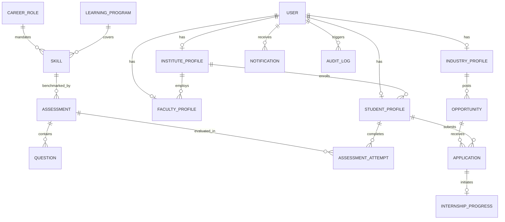

# 05. Database Architecture & Schema Specification

> **Database Engine:** MongoDB (v7.0+)  
> **ODM:** Mongoose (v8.4+)  
> **Architecture:** Normalized Relational Referencing with Target Embedded Subdocuments  

---

## 1. Entity-Relationship (ER) Diagram

---

## 2. Core Entities & Schema Specifications

### `User`
* **Purpose:** Root identity and authentication record.
* **Fields:**
  * `email` (String, unique, lowercase, trimmed, required)
  * `password` (String, hashed via bcrypt salt rounds 10, hidden from default selects)
  * `role` (String, enum: `student`, `faculty`, `industry`, `institute`, `admin`)
  * `status` (String, enum: `active`, `pending_approval`, `suspended`, default: `active`)
  * `isVerified` (Boolean, default: false)
  * `resetPasswordToken` (String), `resetPasswordExpires` (Date)
* **Indexes:** `{ email: 1 }` (unique).

### `StudentProfile`
* **Purpose:** Academic, diagnostic, skill, and portfolio profile for student users.
* **Key Fields:**
  * `user` (ObjectId, ref: `User`, unique)
  * `institute` (ObjectId, ref: `InstituteProfile`)
  * `fullName` (String, required)
  * `degree` (String, enum: `BAMS`, `BHMS`, `BUMS`, `BNYS`, `BSMS`, `MD/MS Ayush`, `B.Pharma Ayush`, `B.Tech`, `B.Sc Healthcare`)
  * `cgpa` (Number, 0.0 - 10.0)
  * `targetCareerRole` (ObjectId, ref: `CareerRole`)
  * `skills` (Array of subdocuments: `{ skill: ObjectId, proficiency: String, proficiencyScore: Number (0-100), isEndorsed: Boolean, verifiedByAssessment: Boolean }`)
  * `projects` (Array: `{ title, description, link, skillsUsed }`)
  * `certifications` (Array: `{ title, issuingOrganization, issueDate, credentialUrl, isVerified }`)
  * `portfolioSlug` (String, unique sparse index)
* **Indexes:** `{ institute: 1, degree: 1 }`, `{ 'skills.skill': 1 }`, `{ portfolioSlug: 1 }`.

### `FacultyProfile`
* **Purpose:** Academic, teaching, research, and corporate consulting profile for professors.
* **Key Fields:**
  * `user` (ObjectId, ref: `User`, unique)
  * `institute` (ObjectId, ref: `InstituteProfile`)
  * `fullName` (String, required)
  * `department` (String)
  * `designation` (String, enum: `Assistant Professor`, `Associate Professor`, `Professor`, `Head of Department`, `Dean`, `Research Fellow`)
  * `yearsExperience` (Number)
  * `expertise` ([String])
  * `publications` (Array: `{ title, journal, year, doiOrLink }`)
  * `industryConsultingHistory` (Array: `{ companyName, projectTitle, year, description }`)
* **Indexes:** `{ institute: 1, department: 1 }`.

### `IndustryProfile`
* **Purpose:** Corporate enterprise profile for hospitals, pharma plants, wellness resorts, and CROs.
* **Key Fields:**
  * `user` (ObjectId, ref: `User`, unique)
  * `companyName` (String, required)
  * `industryType` (String, enum: `Ayush Hospital / Clinic`, `Pharmaceutical / GMP Unit`, `Wellness & Panchakarma Resort`, `Clinical Research Org (CRO)`, `Government / Research Council`)
  * `registrationNumber` (String, required)
  * `location` (`{ city: String, state: String }`)
  * `isApprovedByAdmin` (Boolean, default: false)
* **Indexes:** `{ user: 1 }`, `{ industryType: 1 }`.

### `Skill` & `CareerRole`
* **Skill Fields:** `name` (unique), `category` (`Clinical`, `Pharma_Manufacturing`, `Regulatory_Research`, `Hospital_Admin`, `General_Technical`, `Soft_Skills`, `Aptitude`), `ayushBranch`, `industryDemandScore` (0-100), `benchmarkScore` (0-100).
* **CareerRole Fields:** `title` (unique), `slug` (unique), `industrySector`, `requiredSkills` (`[{ skill: ObjectId, minProficiencyScore: Number, weight: Number }]`), `preferredSkills`, `averageSalaryRange`, `demandIndex`.

### `Assessment`, `Question`, & `AssessmentAttempt`
* **Assessment:** `title`, `skill` (ObjectId ref), `difficulty`, `timeLimitMinutes`, `passingScorePercentage`, `totalQuestions`.
* **Question:** `assessment` (ObjectId ref), `prompt`, `options` (`[{ optionKey, text }]`), `correctOptionKey` (concealed `select: false`), `explanation`, `weightage`.
* **AssessmentAttempt:** `student` (ObjectId ref), `assessment` (ObjectId ref), `scorePercentage`, `passed`, `answers`, `completedAt`.

### `Opportunity`, `Application`, & `InternshipProgress`
* **Opportunity:** `industry` (ObjectId ref), `title`, `type` (`Internship`, `Full-time`, `Clinical Observership`, `Research Fellowship`), `requiredSkills` ([ObjectId]), `preferredSkills` ([ObjectId]), `stipendOrSalary`, `durationMonths`, `status` (`Active`, `Closed`), `deadline`.
* **Application:** `opportunity` (ObjectId ref), `student` (ObjectId ref), `matchScore`, `missingSkills` ([ObjectId]), `status` (`Applied`, `Under_Review`, `Shortlisted`, `Interview_Scheduled`, `Offered`, `Rejected`), `feedback`. Unique compound index on `{ opportunity: 1, student: 1 }`.
* **InternshipProgress:** `application` (unique), `student`, `industry`, `mentor` (`{ name, email, designation }`), `weeklyLogs` (`[{ weekNumber, tasksCompleted, hoursWorked, studentReflections, mentorFeedback, mentorRating, status }]`), `completionStatus`.

---

## 3. Seeded Demonstration Credentials

| Role | Email | Password | Organization / Program |
| :--- | :--- | :--- | :--- |
| **Student** | `student.ayush@gmail.com` | `Password@123` | BAMS Final Year, All India Institute of Ayurveda |
| **Industry** | `careers@dabur.com` | `Password@123` | Dabur Ayush Research & Manufacturing Ltd |
| **Faculty** | `dr.sharma@aiia.ac.in` | `Password@123` | Prof. (Dr.) Rajesh Sharma, Dravyaguna Dept |
| **Institute** | `director@aiia.ac.in` | `Password@123` | All India Institute of Ayurveda (AIIA) |
| **Admin** | `admin@ayush.gov.in` | `Password@123` | Ministry of Ayush Central Administrator |
