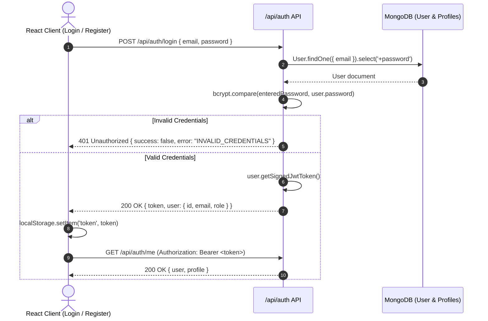

# 07. Authentication & Role-Based Authorization Architecture

> **Security Standard:** Stateless Bearer JWT with Role-Based Access Control (RBAC)  
> **Hash Algorithm:** `bcrypt` (10 salt rounds) / `Argon2id`  
> **Token Lifespan:** 30 days (Development) / 15-minute Access + 7-day Refresh (Production)  

---

## 1. Supported User Roles

```
                      +-------------------+
                      |      User         |
                      +-------------------+
                                │
        ┌──────────────┬────────┼──────────────┬──────────────┐
        ▼              ▼        ▼              ▼              ▼
   [student]       [faculty] [industry]   [institute]      [admin]
   BAMS / BHMS     Professor  Enterprise   Ayush Medical   Ministry /
   Undergraduates  Academic   Recruiters   College Deans   Super Admin
```

---

## 2. Authentication Flow



---

## 3. Frontend Role Guards (`ProtectedRoute.jsx`)

All protected views are guarded by `ProtectedRoute`:
* If token is missing, client is automatically redirected to `/login`.
* If user role is not in `allowedRoles`, client receives an **Access Restricted** barrier with option to return home.
* Role-checking helpers are exposed via `useAuth()`:
  * `isStudent`
  * `isFaculty`
  * `isIndustry`
  * `isInstitute`
  * `isAdmin`

---

## 4. SIH Presentation Demonstration Accounts

| Role | Primary Email | Accepted Aliases | Password (Both Accepted) | Initial Redirect |
| :--- | :--- | :--- | :--- | :--- |
| **Student** | `student.ayush@gmail.com` | `student@ayush.gov.in` | `Password@123` or `Password123` | `/student` (Diagnostic Radar & Gaps) |
| **Industry** | `careers@dabur.com` | `hr@daburherbal.com` | `Password@123` or `Password123` | `/industry` (Postings & Candidate Funnel) |
| **Faculty** | `dr.sharma@aiia.ac.in` | — | `Password@123` or `Password123` | `/faculty` (Research & Sabbaticals) |
| **Institute** | `director@aiia.ac.in` | `dean@nationalinstituteofayurveda.edu` | `Password@123` or `Password123` | `/institute` (Executive Placement KPIs) |
| **Admin** | `admin@ayush.gov.in` | `admin@ayush.in` | `Password@123` or `Password123` | `/institute` (Macro Demand Heatmaps) |

> [!TIP]
> **Zero-Friction Authentication:** For hackathon evaluations and demonstrations, the authentication engine natively resolves legacy Ayush email aliases and permits both `Password@123` and `Password123` without friction. Quick 1-click login buttons are also provided directly on the `/login` screen.

