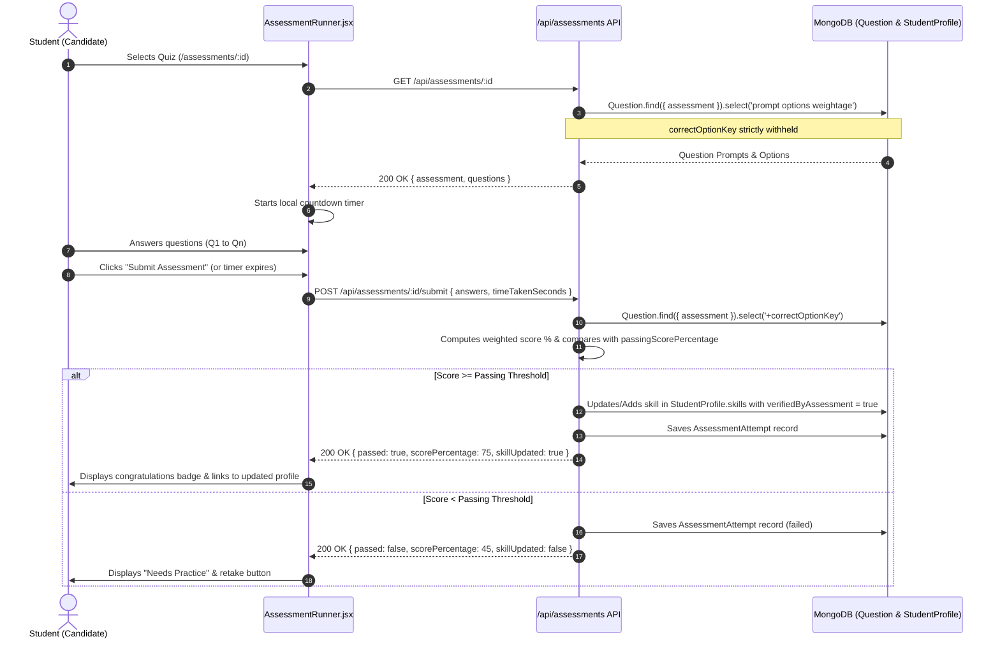

# 08. Skill Taxonomy & Diagnostic Assessment Engine

> **Subsystem:** Diagnostic Assessment & Empirical Skill Benchmarking  
> **Question Bank Security:** Server-Side Answer Shielding (`correctOptionKey` omitted)  
> **Evaluation:** Timed Auto-Grading with Real-Time Skill Profile Updating  

---

## 1. Skill Taxonomy Categories

1. **Clinical:** Classical diagnostic examination (Nadi Pariksha), therapy planning (Panchakarma), and clinical interventions.
2. **Pharma_Manufacturing:** Schedule T Good Manufacturing Practice (GMP), batch manufacturing records (BMR), cleanroom operations, and phytochemical solvent extraction.
3. **Regulatory_Research:** Good Clinical Practice (GCP), clinical trial documentation, Pharmacovigilance (NPvC), and ASU drug safety reporting.
4. **Hospital_Admin:** Electronic Health Records (EHR), hospital accreditation (NABH), and telemedicine protocols.
5. **General_Technical:** Digital healthcare tools, chromatography data systems, and tele-consultation triage.
6. **Soft_Skills:** Patient dietary counseling (Pathya-Apathya) and bedside communication.
7. **Aptitude:** Clinical logic, problem-solving, and numerical dosage calculations.

---

## 2. Assessment Runner Workflow

---

## 3. Real-Time Radar Update Rule
When a candidate passes an assessment:
* If the skill is already in their profile, `proficiencyScore` is upgraded to the new score if it exceeds their previous record.
* If the skill was missing, it is appended to `StudentProfile.skills` with `verifiedByAssessment = true` and `lastAssessedAt = new Date()`.
* The updated score directly flows into the **Skill Gap Analyzer** and the **Opportunity Recommendation Engine**!
