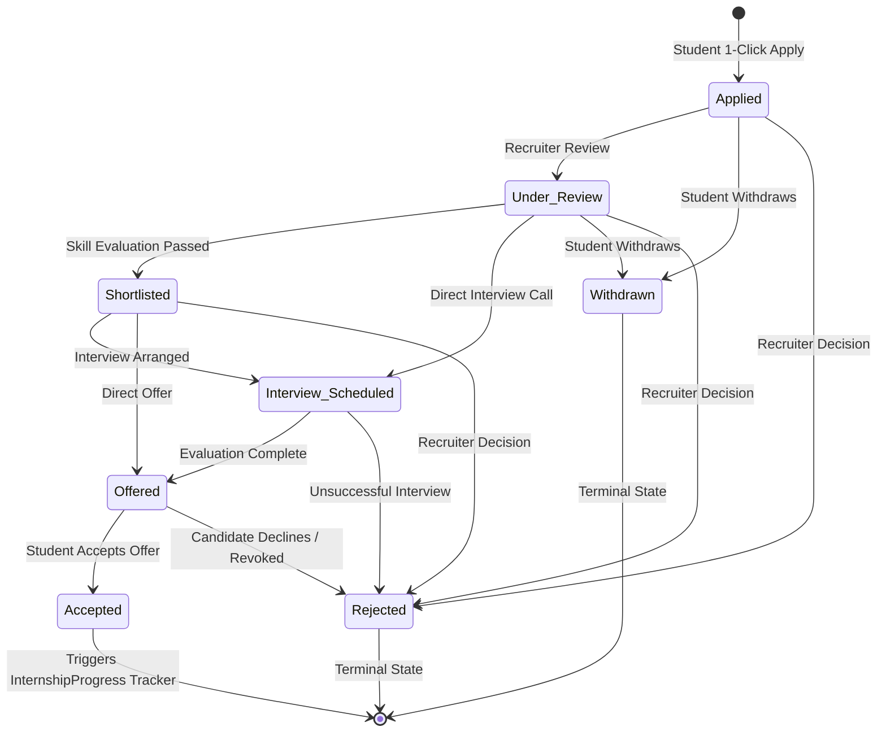

# Internship & Opportunity Management System

## Overview
The **Internship & Opportunity Management Subsystem** connects industry recruiters with verified Ayush scholars. The system enforces strict candidate pre-ranking based on empirical skill compatibility match scores, an auditable 6-stage recruitment state machine, and automated transition from job offer acceptance to active internship milestone tracking.

$$\mathbf{Candidate\ Applied} \longrightarrow \mathbf{Compatibility\ Scored} \longrightarrow \mathbf{Pipeline\ Stepper} \longrightarrow \mathbf{Offer\ Letter} \longrightarrow \mathbf{Milestone\ Tracker}$$

---

## Recruitment State Machine

The recruitment pipeline operates under a strict finite-state automaton (FSA) with authorization guards:

### Transition Validation Table

| Current State | Permitted Transitions | Authorized Role | Auto Side-Effects |
| :--- | :--- | :--- | :--- |
| `Applied` | `Under_Review`, `Shortlisted`, `Rejected` | Industry / Admin | Status timestamp updated |
| `Applied` | `Withdrawn` | Student | Cancellation audit logged |
| `Under_Review` | `Shortlisted`, `Interview_Scheduled`, `Rejected` | Industry / Admin | Recruiter notes saved |
| `Under_Review` | `Withdrawn` | Student | Reason recorded |
| `Shortlisted` | `Interview_Scheduled`, `Offered`, `Rejected` | Industry / Admin | Calendar coordination note |
| `Interview_Scheduled` | `Offered`, `Rejected` | Industry / Admin | Evaluation score recorded |
| `Offered` | `Accepted` | Student / Industry | **Initializes active `InternshipProgress` record** |
| `Offered` | `Rejected` | Student / Industry | Offer declined |
| `Accepted` | None (Terminal) | — | Unlocks weekly milestone logging |
| `Rejected` | None (Terminal) | — | Final decision |
| `Withdrawn` | None (Terminal) | — | Inactive |

---

## API Endpoints Reference

| Method | Endpoint | Access Guard | Description |
| :--- | :--- | :--- | :--- |
| `POST` | `/api/industry/opportunities` | Industry, Admin | Publishes a new internship / full-time role with required skills and deadline. |
| `GET` | `/api/industry/opportunities` | Industry, Admin | Retrieves all postings belonging to the logged-in company profile. |
| `GET` | `/api/industry/opportunities/:id/applicants` | Industry, Admin | Retrieves candidate applications pre-ranked by compatibility match score. |
| `PUT` | `/api/industry/applications/:id/status` | Industry, Admin | Validates state machine progression and updates candidate pipeline state. |
| `GET` | `/api/students/matched-opportunities` | Student | Returns active opportunities ranked by snapshot candidate match percentage. |
| `POST` | `/api/students/apply/:opportunityId` | Student | Submits candidate profile with real-time skill match calculation; blocks duplicates. |
| `GET` | `/api/students/my-applications` | Student | Returns all applications submitted by candidate with live pipeline stages. |
| `PUT` | `/api/students/applications/:id/withdraw` | Student | Withdraws active submission from `Applied` or `Under_Review` states. |
| `PUT` | `/api/students/applications/:id/accept` | Student | Accepts extended offer and initializes the `InternshipProgress` document. |

---

## Frontend Components

1. **`IndustryDashboard.jsx` (`/industry`)**:
   - Recruiter KPI overview (Active Postings, Total Applicants, In Review, Offers Extended).
   - Enterprise Opportunity Posting Wizard with multi-select skill chips, duration, stipend, and deadline picker.
   - Pre-ranked candidate table with instant match percentage pills.
   - Candidate Review Modal with public portfolio links, verified skill badges, missing skill alerts, and state machine transition controls.
2. **`StudentApplications.jsx` (`/applications`)**:
   - Visual 6-step progress pipeline tracker per application.
   - Filter tabs: `All`, `In Progress`, `Offers & Accepted`, `Closed / Withdrawn`.
   - 1-Click "Accept Official Offer" button when status reaches `Offered`.
   - "Withdraw Submission" action with reason modal.
3. **`OpportunityCard.jsx`**:
   - Reusable component displaying company details, duration, stipend, match score badge, and 1-click apply action.

---

## Verification & Automated Test Suite

Validated through [`backend/tests/phase10_internship_test.js`](file:///c:/Users/vj789/.gemini/antigravity/scratch/skillbridge-ayush/backend/tests/phase10_internship_test.js):
- `✔ Test 1`: Industry recruiter authenticated.
- `✔ Test 2`: Student authenticated.
- `✔ Test 3`: Active skills catalog retrieved.
- `✔ Test 4`: Opportunity posted successfully via wizard API.
- `✔ Test 5`: Student applied with match calculation.
- `✔ Test 6`: Duplicate apply prevented with `400 ALREADY_APPLIED`.
- `✔ Test 7`: State machine transition: `Applied` $\to$ `Under_Review`.
- `✔ Test 8`: State machine blocked illegal transition: `Under_Review` $\to$ `Offered` (`400 INVALID_STATE_TRANSITION`).
- `✔ Test 9`: Sequential valid transitions: `Under_Review` $\to$ `Shortlisted` $\to$ `Interview_Scheduled` $\to$ `Offered`.
- `✔ Test 10`: Student accepted offer: transitioned to `Accepted`.
- `✔ Test 11`: Automated `InternshipProgress` tracking document initialization verified.
- `✔ Test 12`: Student application withdrawal verified (`Withdrawn`).

**Pass Rate:** 12/12 (100%).
